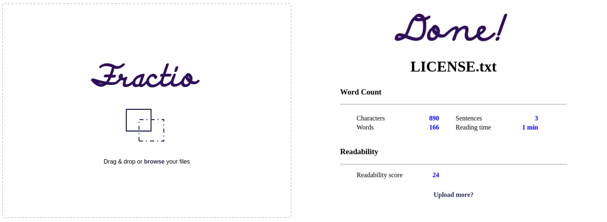

<h1 align="center">
  <br>
  <a href="https://github.com/munabedan/fractio"></a>
  <br>
  
</h1>

<h4 align="center">Fractio is an eel based tool for calculating document statistics such as character, word and sentence count. It also calculates estimated reading time and assigns the document a readability score.</h4>

<p align="center">
  <a href="https://www.python.org/">
  " />
  </a>
<br>
  <a href="https://github.com/python-eel/Eel">
  " />
  </a>
<br>
  <a href="https://github.com/prosegrinder/python-syllables">
  "  />
  </a>  
<br>
  <a href="https://opensource.org/licenses/MIT">
  " alt="License" />
  </a>
 

</p>

<p align="center">
  <a href="#key-features">Key Features</a> •
  <a href="#how-to-use">How To Use</a> •
  <a href="#credits">Credits</a> •
  <a href="#contributing">Contributing</a> •
  <a href="#license">License</a> •
</p>



## Key Features

* Full screen mode
  - Write distraction free.
* Cross platform
  - Windows, macOS and Linux ready.

## How To Use

To clone and run this application, you'll need [Python](https://www.python.org/) and [Pip](https://pypi.org/project/pip/) installed on your computer. From your command line:

```bash
# Clone this repository
$ git clone https://github.com/munabedan/fractio.git

# Go into the repository
$ cd fractio

# Install dependencies
$  pip install -r requirements.txt

# Run the app
$ python3 rtc.py
```


## Credits

This software uses the following open source packages:

- [Eel](https://github.com/python-eel/Eel)
- [Syllables](https://github.com/prosegrinder/python-syllables.git)


## Contributing
I welcome anyone to contribute to this project.


## License
This project is distributed under an [MIT](LICENSE) license.

---

> Email [munabedan@gmail.com](munabedan@gmail.com) &nbsp;&middot;&nbsp;
> GitHub [@munabedan](https://github.com/munabedan) &nbsp;&middot;&nbsp;
> Reddit [@munabedan](https://www.reddit.com/user/munabedan)


